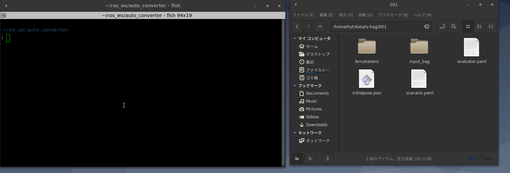
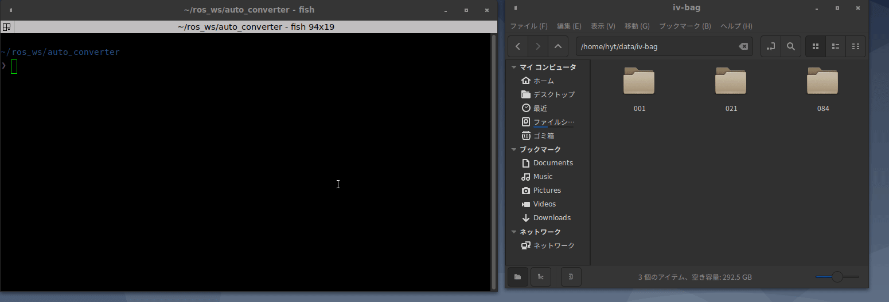

# iv to auto bag converter

This package converts rosbag2(.db3) file created by Autoware.IV to Autoware.Auto

## Demo

convert one bag


convert multi_bags


## Requirements

- ROS2 galactic
- vcstool

## Installation

1. clone this package into the ros2 workspace
2. clone dependency repositories
3. build workspace

```shell
# example
mkdir -p ~/auto_converter_ws/src
cd ~/auto_converter_ws/src
git clone git@github.com:tier4/iv_to_auto_bag_converter.git
cd iv_to_auto_bag_converter
vcs import .. < dependency.repos
cd ~/auto_converter_ws
colcon build --symlink-install --cmake-args -DCMAKE_BUILD_TYPE=Release
```

## Usage

```shell
source ~/auto_converter_ws/install/setup.bash

# convert one bag
ros2 run iv_to_auto_bag_converter $(input_bag_path) $(output_bag_path) [-q $(qos_override_file_name)]

# convert multiple bags in the directory
ros2 run iv_to_auto_bag_converter $(input_bag_path) [-q $(qos_override_file_name) --delete] 
```
